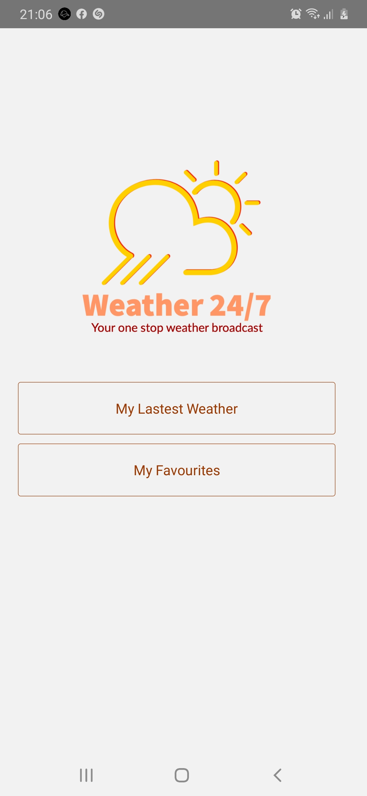
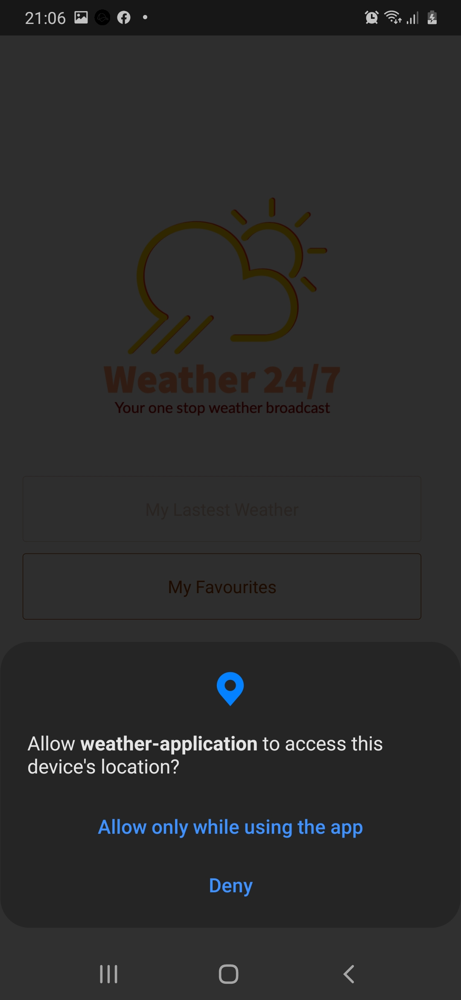
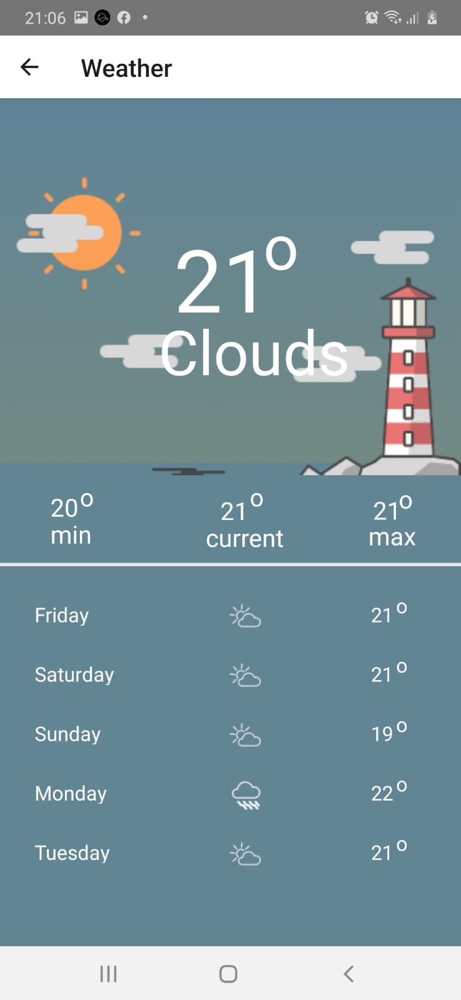
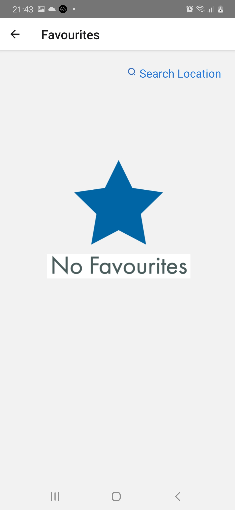
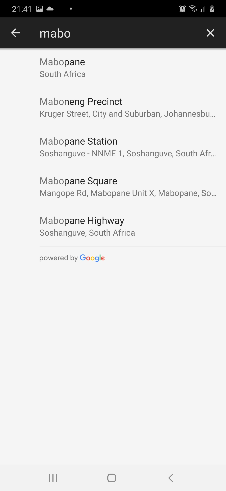
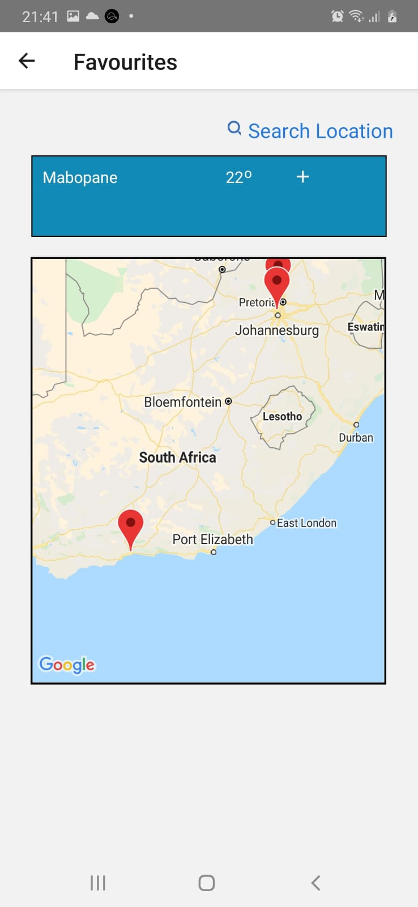
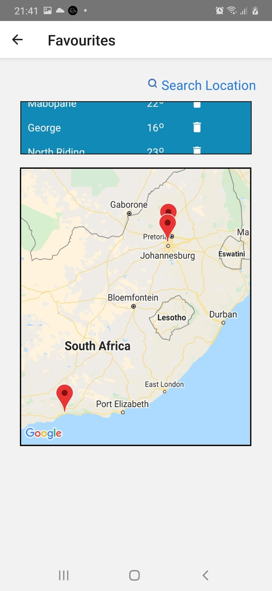
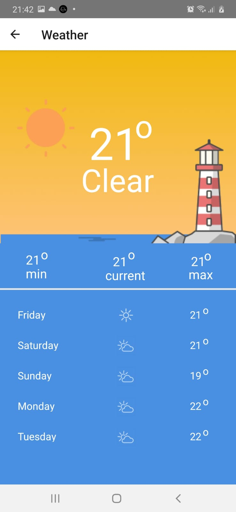

# WeatherApplication
Weather Application

# IOS
yarn install  
cd ios  
run pod install   
cd ../  
yarn ios

# ANDROID
yarn install  
yarn android

# ANDROID Screens

Landing Screen 
 
Upon Clicking My Latest Weather 
Location Permissions Screen 
 
Current Location forecast 
 
My Favourites Screen 
 
Location Search upon clicking search location  
 
View/Add Location to Favourites  
 
List of stored to Favourites in a ScrollView and Markers showing on Map  
 
Upon clicking on one of the markers, you will be directed to the weather screen to view the locations forecast  
 

